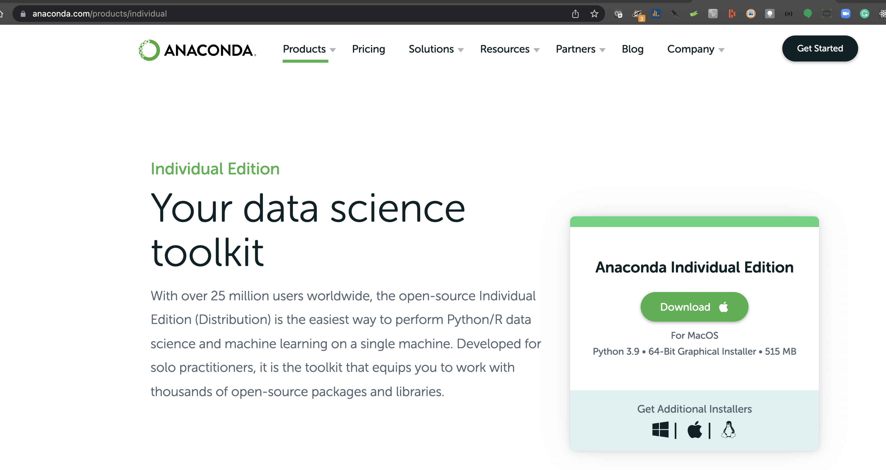

#### Install Anaconda using Graphical Interface

- Download the Individual Edition as show in the below image

.

- Find the downloaded dmg file in the `Downloads` folder.

- Right click the dmg file and click the open.

- Installer window should open as below. Click next and proceed till it completes installation

