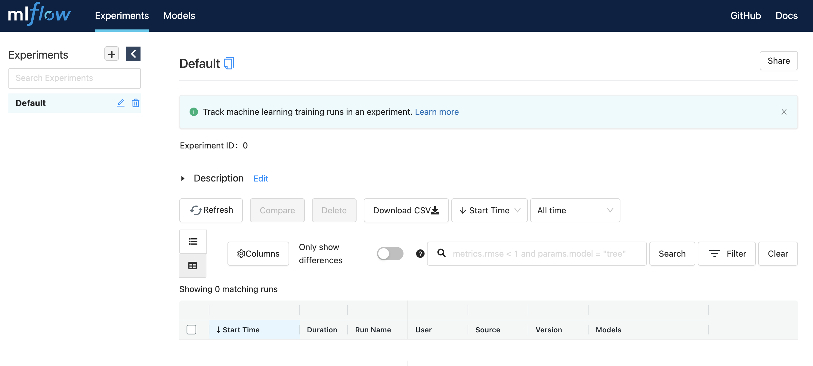

# Experiments Tracking, Model Management, and Dataset Versioning

In this chapter, we introduce a set of useful tools for experiments tracking, model management, and dataset versioning which enables effective management of DL projects. The tools we will be discussing in this chapter help us in tracking a large number of experiments and interpreting the results more efficiently which naturally leads to a reduction in operational costs and boost the development cycle.

*	[Weights & Biases](https://wandb.ai/site/experiment-tracking)
*	[MLflow](https://mlflow.org/docs/latest/tracking.html)
*	[SageMaker Studio](https://aws.amazon.com/sagemaker/studio/)
*	[Kubeflow](https://www.kubeflow.org/)
*	[Neptune](https://neptune.ai/product)
*	[Comet](https://www.comet.ml/site/data-scientists/)
*	[Polyaxon](https://polyaxon.com/)
*	[Valohai](https://valohai.com/product/)

## DL project tracking with Weights & Biases

[Weights & Biases (W&B)](https://wandb.ai/site/experiment-tracking) is an experiment management platform that provides versioning on models and data. One of the key advantages of W&B comes from its interactive dashboard. It is available as a stand-alone webpage, but you can also embed it into your Jupyter notebook.

In order to use W&B, you need to install and link your account. The details can be found [here](https://docs.wandb.ai/quickstart)
```
pip install wandb
wandb login
```


In the notebook, [W&B.ipynb](https://github.com/PacktPublishing/Production-Ready-Applied-Deep-Learning/blob/main/Chapter_4/W%26B.ipynb), we describe how to use W&B for tracking a model training.

## DL project tracking with MLflow and DVC

Mlflow is a popular framework that supports tracking technical dependencies, model parameters, metrics, and artifacts. The key components of Mlflow include
*	Tracking – keeping track of results changes every time model is run
*	Projects – packaging model code in a reproducible way
*	Models – packaging model artifacts for future convenient deployment
*	Model Registry – managing a full lifecycle of an Mlflow Model
*	Plugins – API allowing writing integration plugins with different DL frameworks and backends

## Setting up MLflow
```
pip install mlflow
```
To start UI locally simply type:
```
mlflow ui
```
and in your webbrowser type http address that is displayed in the row "Listening at: " 
```
[INFO] Listening at: http://127.0.0.1:5000
```
if you are doing this for a first time, you will see UI with default page without any experiments. 
<p align="center">
  
</p>

A few examples of basics of experiment tracking with MLflow are presented [here](mlflow.ipynb) 

In the notebook, [MLFlow_dvc.ipynb](https://github.com/PacktPublishing/Production-Ready-Applied-Deep-Learning/blob/main/Chapter_4/MLFlow_dvc.ipynb), we describe how to use MLFlow and DVC for tracking a model training.
