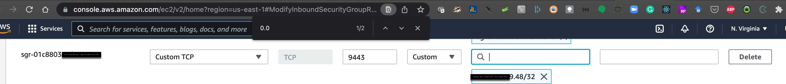

### EMR Setup

// ToDo: Rearrange sequence

- Visit [this](https://whatismyipaddress.com/) website to note down your `ip address`

[//]: # (![]&#40;./images_emr/emr_28.png&#41;  not needed &#40;new cluster page again&#41;)
[//]: # (![]&#40;./images_emr/emr_27.png&#41;)  not with Advanced option for cluster creation
[//]: # (![]&#40;./images_emr/emr_26.png&#41;) not with Advanced option for cluster creation
[//]: # (![]&#40;./images_emr/emr_25.png&#41;) not with Advanced option for cluster creation
Cluster creation in `Starting` status

Choose Cluster Nodes and Instances

Step 1: Cluster Creation -> Software Configuration

Step 1: Cluster Creation -> Software Configuration

In the Application interface, get the `User Interface URL` for `JupyterHub`

Use `whatismyipaddress.com` to get your ipv4 address.

Put the jupyterHub in the browser and click `Advanced` 

Hit 'Accept the Risk and Continue'

Provide username and password for JupyterHub.

Jupterhub application showing a list of notebooks. Click `New` and hit `PySpark`

Terminate cluster pop-up.

Terminate the cluster with the `Terminate` button

In the newly created Jupyter notebook, below example shows importing `pyspark` and `tensorflow`

New cluster created with `Running` status.

We need to add rule for inbound rule opening 9443 port (`Custom TCP`). See below two images having an 
already list of rules.

Contiuation from last image, put your ip address with /32 added.

Choose the security group used for EMR master.

[//]: # (![]&#40;./images_emr/emr_6.png&#41; # AWS security hub &#40;not needed&#41;)
Home page of `Security Groups`. It can be found by searching for "Security groups" in the search bar on the top of the console.

Step 3: General Cluster Settings

Step 4: Security

Home page for Amazon Cluster. Hit `Create Cluster` button

Step 2: Hardware configuration
