### Setting up an EMR Cluster for ETL

In this file, we will show how to create a new cluster step-by-step. 

#### Prerequisite:

1. Home page of `Security Groups`. It can be found by searching for "Security groups" in the search bar on the top of the console.
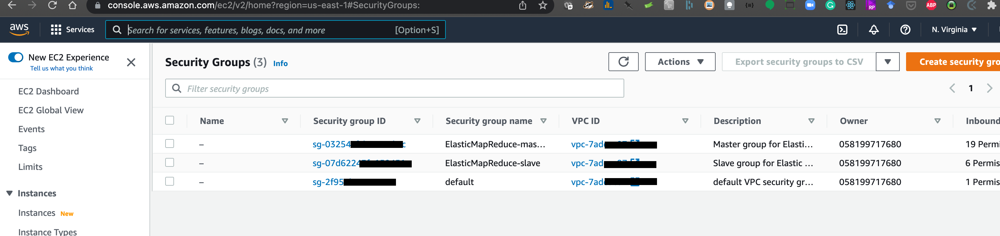
2. Visit [this](https://whatismyipaddress.com/) website to note down your `ip address`
Use `whatismyipaddress.com` to get your ipv4 address.
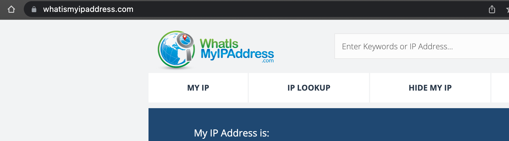

#### Creating a new EMR cluster
Open the Amazon EMR service to start creating a new cluster. 

Search and open the EMR service
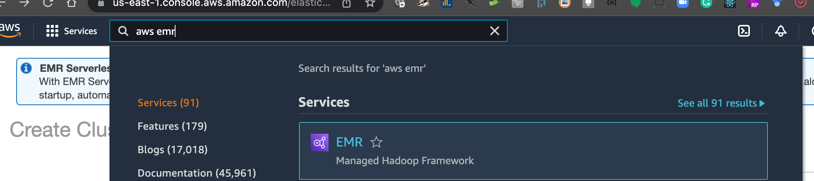
The landing page of EMR service shows this quick option page, just hit the button `Go to advanced options`
which will take you to the next page
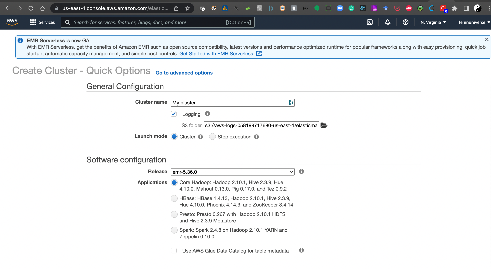

Step 1: Cluster Creation -> Software Configuration
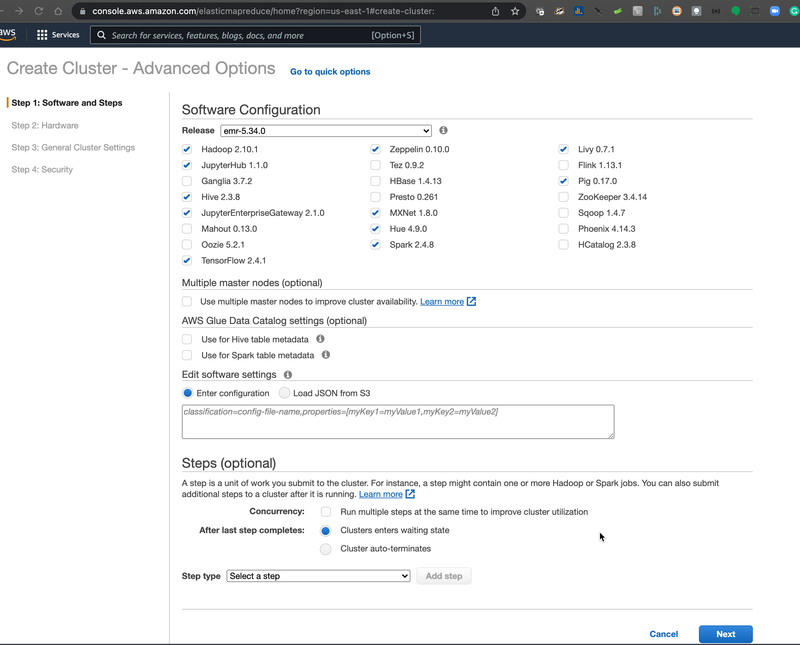
Step 1: Cluster Creation -> Software Configuration

Step 2: Hardware configuration
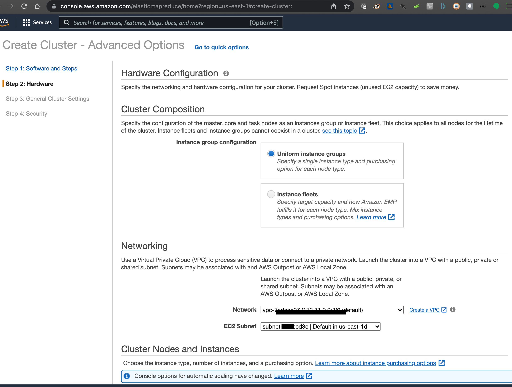
Step 2: Choose Cluster Nodes and Instances
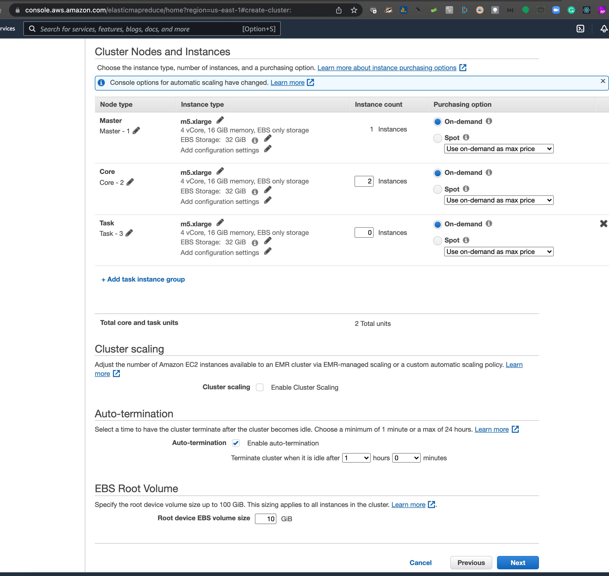
Step 3: General Cluster Settings
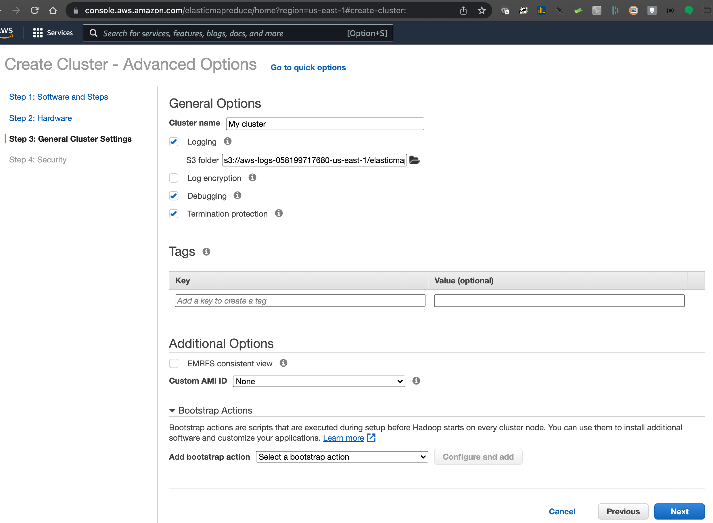
Step 4: Security. Fill in the details (Ec2 key pair, security groups etc.) and hit `Create cluster`

Cluster creation will start with `Starting` status
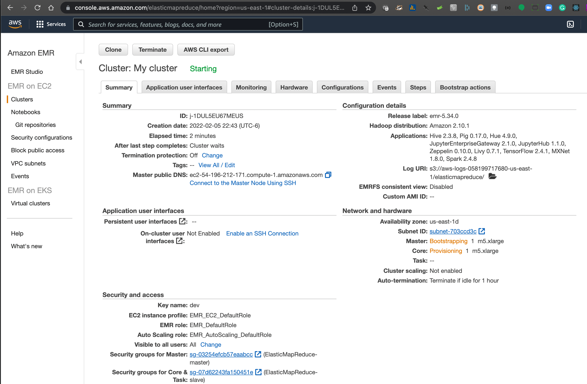

After some time, the cluster goes to `Running` status. Now, you can open JupyterHub as explained in the following steps.

#### JupyterHub
In the Application interface, get the `User Interface URL` for `JupyterHub`

Put the jupyterHub in the browser and click `Advanced` 

Hit 'Accept the Risk and Continue'
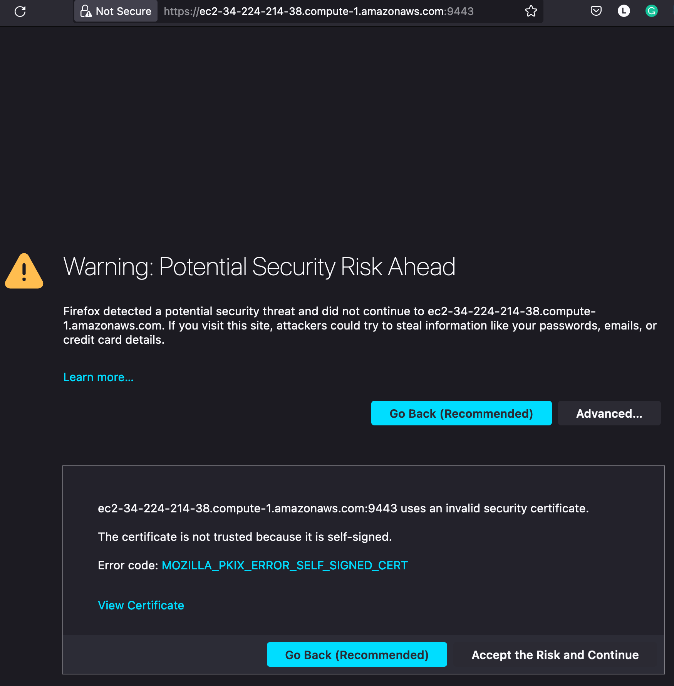
Provide username and password for JupyterHub.

Jupterhub application showing a list of notebooks. Click `New` and hit `PySpark`
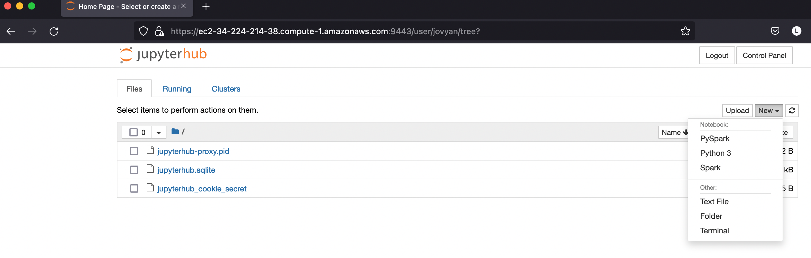

In the newly created Jupyter notebook, below example shows importing `pyspark` and `tensorflow`

#### Terminating cluster
Terminate cluster pop-up.

Terminate the cluster with the `Terminate` button
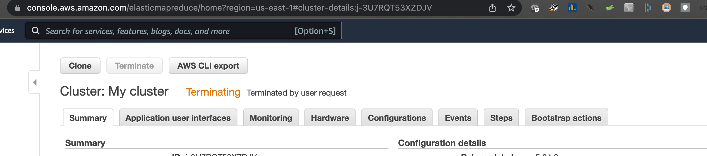

#### Adding inbound rules under Security Group
We need to add rule for inbound rule opening 9443 port (`Custom TCP`). 

Find and open the `Security Groups` service.
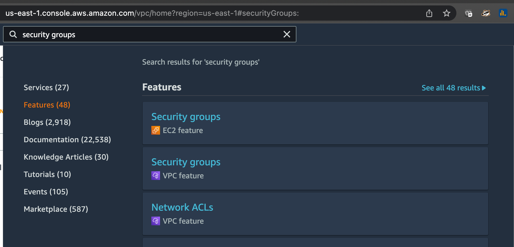

The landing page shows the list of security groups and choose the security group which is used while
creating your EMR cluster in order to edit its inbound rules.

For the remaining, follow the steps under **"Create Security Group that has access to ec2 from your laptop"**
in 