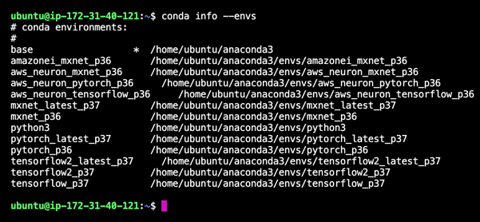

## Amazon Elastic Compute Cloud - EC2

#### Single EC2 with AMI - deep-learning AMI ubuntu - has conda 

Assuming that one has created an AWS account with an email id and logged into aws console (i.e., root user), we are creating an IAM user.

Create an account with your email id and then use it to login with below link

<https://console.aws.amazon.com>

In this section, we create a role, security group with inbound access from one's laptop and then create an ec2 instance with a Deep Learning image for Ubuntu 18.0. Finally, connect to the ec2 instance from the terminal with a .pem file.

**Activate MFA**

Activate extra security for your account by registering the AWS account with your mobile phone.

Click 'Activate MFA'

- Install the *Microsoft Authenticator* in your mobile phone. Add an organization name in the app and choose as Personal account, and then choose 'Scan QR code'  
- To continue in the AWS console, hit 'Show QR code' in the screen below and then scan the QR code with your mobile phone. That sound makes the MFA setting successful between your phone and the AWS account. Now enter two subsequent MFA codes from the app into the field mentioned in 3 below. After you hit `Assign MFA` one should see the success message below.

**Create a Role:**

- Click 'Create Role' button in the IAM page below after choosing the 'Roles' in the left pane

Choose 'EC2' in the below page

Step 1: Create role with below permissions

**Create Security Group that has access to ec2 from your laptop**

Click 'Edit inbound rules' button in below page

Delete below already existing rule

Add my IP rule as below. It will automatically pick your ip address under that search bar tab. Hit 'Save Rules' button

Reference: <https://docs.aws.amazon.com/vpc/latest/userguide/VPC_SecurityGroups.html>

**EC2 instance creation steps:**

1. Login to the amazon console

<https://console.aws.amazon.com/>

1. Search for ec2 in the search bar and then hit enter
1. On the top right, if it is not already in Ohio region, then choose Ohio Region for cheaper pricing of ec2 instances

1. Choose the Launch a virtual machine in the provide option as seen below

1. In Step 1, Choose the below image named **Deep Learning AMI (Ubuntu 18.04) Version 48.0**

1. In Step 2, choose fier tier instance **m4.large** and hit 'Next: Configure instance details'

1. In Step 3, Choose default network and subnet. Choose *Number of instances* as 1 since we will have only one node in this EMR cluster. Choose the created role 'ec2-role' in the drop down.

(Note: One can enable monitoring by checkboxing the option 'Enable CloudWatch detailed monitoring' but it incurs additional charges for CloudWatch monitoring service)

1. In Step 4 on *Add Storage,* add 100GB in the Size* field. Tick the checkbox *Delete on Termination*
1. In Step 5 on *Add Tags*, one can add some useful tags for tracking the cost.

` `

1. Step 6, Choose a Security Group as default one and hit Next.

(Note: Above page shows source as the ip address of the machine one provided access to while creating the security group in the earlier steps of this chapter)

Ref: <https://aws.amazon.com/premiumsupport/knowledge-center/ec2-block-or-allow-ips/>

1. Step 7 is to review the configurations done from past steps and then Launch

(Note. Read the Warning message stated as *Your instance configuration is not eligible for the free usage tier)*

1. In the pop-up, create the key pair and download the .pem file. Download will enable the 'Launch Instance' button. In this case, the downloaded pem file dev.pem.

Click on the View Instance 

Click on the instance id and copy the ipv4 address of the instance. Click on 'Connect' on the top right in the below page. Wait for Instance state to be running before trying to connect with ssh.

- Choose connect to see the instructions

1. Connect to the ec2 instance created from the terminal application in mac. One can use either iterm2 or Hyper application also.

<https://docs.aws.amazon.com/AWSEC2/latest/UserGuide/AccessingInstancesLinux.html>

- Provide permission for the downloaded dev.pem file using chmod

*chmod 400 dev.pem*

- Run below ssh command by replacing with your ip address in the place of x.x.x.x below

*ssh -i ~/Downloads/dev.pem **ubuntu**@x.x.x.x*

Example:

*ssh -i ~/Downloads/dev.pem **ubuntu**@52.14.251.9*

Type yes and press enter button like the example shown below

- Now you are logged into the machine with the above shown kind of ssh command. Shown example below. Type python3 and press enter to know the different python versions available.

- List conda environments. It has different environments that includes tensorflow environment (e.g., tensorflow\_p37), pytorch (pytorch\_latest\_p37), and mxnet (e.g., mxnet\_latest\_p37).

Example showing activation of latest tensorflow environment

Example showing importing of tensorflow 2

For more examples on importing pytorch and mxnet.

Reference: <https://docs.aws.amazon.com/dlami/latest/devguide/tutorial-tensorflow.html>

