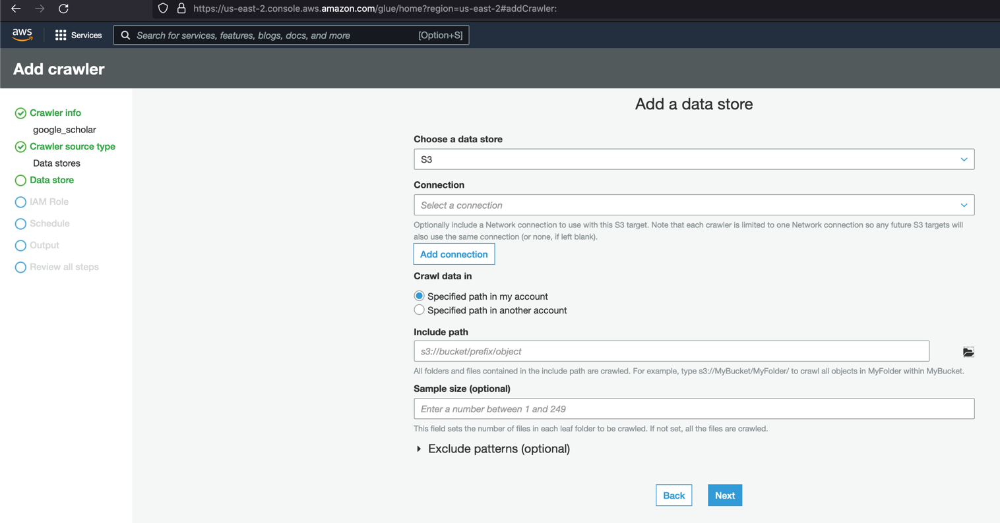
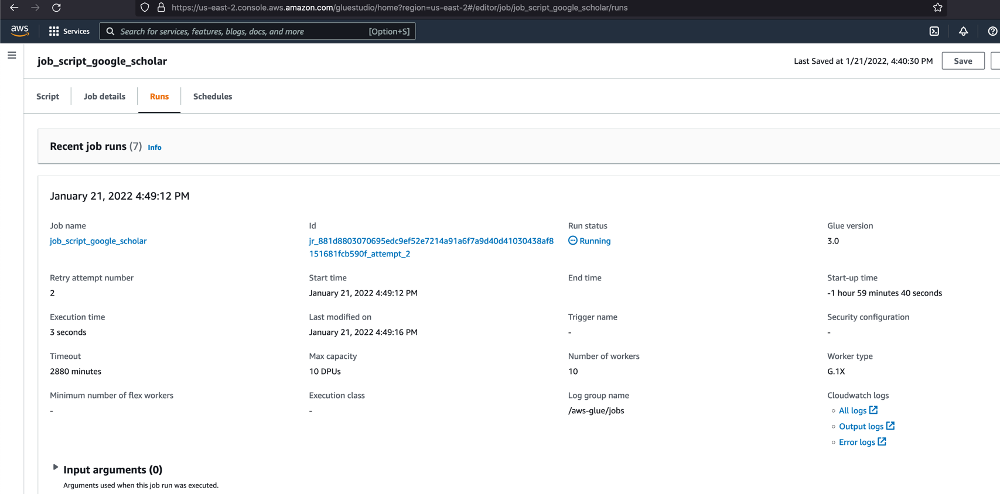

This document explains the steps that need to create a new AWS Glue Job.

#### Step 1: Create s3 bucket for the glue job. Two sub-folders "read" and "write" will be created
#### Step 2: Create Policy that has necessary permission for Glue and S3 bucket
#### Step 3: Create Crawler that takes input data set (csv file) and create a metadata table inside newly created database "db_google_scholar"
#### Step 4: Create a Glue Job. Script [glue_job_google_scholar.py](./glue_job_google_scholar.py) that runs in the job.

------------------------------------------------------------------------------------

#### Step 1: Create s3 bucket for the glue job. Two sub-folders "read" and "write" will be created


#### Step 2: Create Policy that has necessary permission for Glue and S3 bucket

- Create a policy that have access to the S3 buckets. You may select to give permission to all buckets (see below) or specific buckets.

```
{
    "Version": "2012-10-17",
    "Statement": [
        {
            "Sid": "VisualEditor0",
            "Effect": "Allow",
            "Action": [
                "s3:*",
                "glue:*"
            ],
            "Resource": "*"
        }
    ]
}
```

- Create a new IAM role (say: AmazonSageMakerServiceCatalogProductsUseRole) and attach the policy created in the above step.

#### Step 3: Create Crawler that takes input data set (csv file) and create a metadata table inside newly created database "db_google_scholar" 

Go to [Glue](https://us-east-2.console.aws.amazon.com/glue/home?region=us-east-2#)





#### Step 4: Create a Glue Job. Script [glue_job_google_scholar.py](./glue_job_google_scholar.py) that runs in the job. 





The downloaded csv file showing the glue job writen CSV content


Monitor

